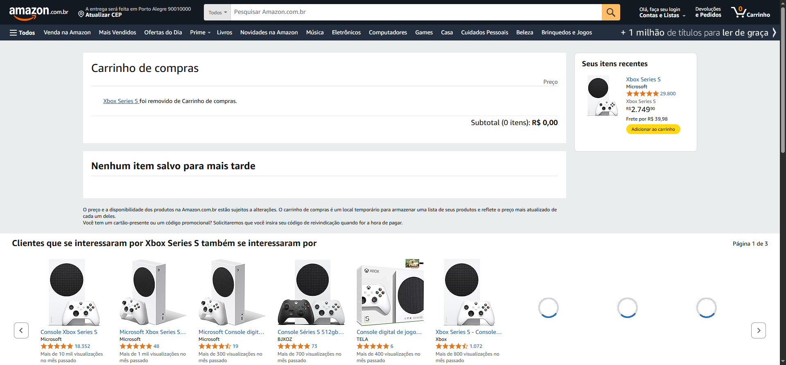

# Robot_training_Udemy

## [Documentation](https://robotframework.org/?tab=1#getting-started)
### [Selenium Library](https://github.com/robotframework/SeleniumLibrary/?tab=readme-ov-file#installation)

| Step    | Instalations                                                   | 
| ------- | ---------------------------------------------------------------| 
|    1    | python download                                    |   
|    2    | pip install robotframework                                             |   
|    3    | pip install --upgrade robotframework-seleniumlibrary           |  
|    4    | pip install robotframework-requests                            |       
|    5    | pip list (see all packages)                                    |                 

| Examples| Terminal                                                       | 
| ------- | ---------------------------------------------------------------| 
|    1    | robot -t test_name file_name.robot                             |   
|    2    | robot -d file_name_evidence file_name.robot                    |   
|    3    | robot -e tag_name file_name.robot     (except)                 |  
|    4    | robot -i tag_name file_name.robot                              |       
|    5    | robot -v variable_name file_name.robot                         |                 
|    Command type   |                                                                |    
|    7    | robot -i remove -d ./resultado_testes_BDD_CT04  amazon_testes_BDD.robot  |  

